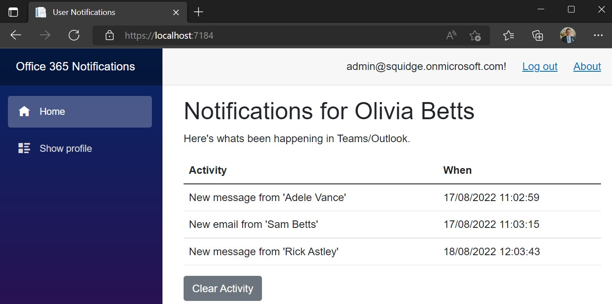
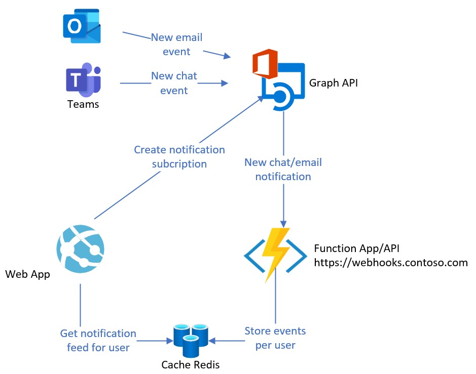

# Office Notifications PoC
Implement your own Office 365 notifications and activity streams from Office 365 events, using Graph webhooks. Don't like the default notifications system? Build your own version following this PoC.

Here's a basic example - a page that updates with events relevant to the user as they happen:



This kind of information can be useful for intranet dashboards, etc. You decide where and how you want to present this information.

How does it work? With Graph webhooks is how:


We use webhooks from Graph to get notified of updates for specific users (people on the intranet site), and then when we get told about things happening we store a brief summary in redis - one list per user.

More specifically the notifications we receive contain the resource data of the update in question (chats & outlooks messages in our case), and there's a whole background you need to know about on how they work - https://docs.microsoft.com/en-us/graph/webhooks-with-resource-data

## Technical Considerations for Notifications
As we're dealing with notifications with resource-data included, we need a X.509 certificate to set these notification types up (see link above for why). For this certificate we need Azure Key Vault to store & retrieve it.

In addition we use Service Bus to process messages - when we get them from Graph API calls, the only thing we do initially is to add the message to Service Bus so we can ensure a prompt reply to Graph so we reply promptly and don't lose the subscription due to performance issues. More info on reply requirements to webhook notifications - https://docs.microsoft.com/en-us/graph/webhooks#processing-the-change-notification

Then on the Service Bus message received event for the same message we process the contents: decrypting the payload so we can extract metadata of whatever it is (email, chat), and then add to the appropriate users' notification list. Note: the "for user" field is actually stored on the notification 'clientState' field when the subscription is created. 

## Permissions Needed
We need the following Graph API permissions (application) on an application registration:
* Mail.Read - on the assumption we want to read emails when they arrive.
* Chat.Read.All - on the assumption we want to read chat messages when they arrive.
* User.Read.All - to resolve user IDs to email addresses.

## Configuration 
Name | Example Value | Description
--- | ---- | ----
ConnectionStrings:ServiceBus | Endpoint=sb://contoso.servicebus.windows.net/;SharedAccessKeyName=n;SharedAccessKey=xxxxxx | Connection string for a Service Bus queue
ConnectionStrings:Redis | contoso.redis.cache.windows.net:6380,password=xxxxx,ssl=True,abortConnect=False | Redis connection string
AzureAd:Domain | contoso.com | Azure AD registered domain
AzureAd:TenantId | [guid] | Tenant ID
AzureAd:ClientId | [guid] | App registration client ID 
AzureAd:ClientSecret | [secret string] | App registration secret
WebhookUrlOverride | https://sambetts.eu.ngrok.io/api/GraphNotifications | Url of the webhook for Graph API
AppInsightsInstrumentationKey (optional) | [guid] | Application Insights key

## Azure Resources Setup
Create and configure the following resources:
* Azure Service Bus Namespace
  * Create a queue 'graphcalls' + shared access policy with "listen" and "send" rights.
  * Copy primary connection string.
* Key vault
  * Generate a new certificate with name "webhooks", subject "cn=webhooks". All the rest as default. (this certificate logic needs to be improved)
* Redis cache
  * Get Primary connection string (StackExchange.Redis)
* Production only: Azure function app.
* Recommended: create an Application Insights for telemetry.

## Function App Configuration
For local dev especially, you'll need to create local file copies of template configuration. Especially:
* local.settings - template.json -> local.settings.json

In local.settings.json, under "Values:ServiceBusConnectionString", copy the service bus connection string but without the "EntityPath" bit at the end:

SB Queue connection string for access policy:
```
Endpoint=sb://contoso.servicebus.windows.net/;SharedAccessKeyName=n;SharedAccessKey=xxxxxx;EntityPath=graphupdates
```

Functions app values version:
```
Endpoint=sb://contoso.servicebus.windows.net/;SharedAccessKeyName=n;SharedAccessKey=xxxxxx
```
This truncated version goes in local.settings.json:
```json
{
  "IsEncrypted": false,
  "Values": {
    "AzureWebJobsStorage": "UseDevelopmentStorage=true",
    "FUNCTIONS_WORKER_RUNTIME": "dotnet-isolated",
    "ServiceBusConnectionString": "Endpoint=sb://contoso.servicebus.windows.net/;SharedAccessKeyName=n;SharedAccessKey=xxxxxx;EntityPath=graphupdates"
  }
}
```
# Testing
Launch and login to the web-application. The first thing you need to do it activate notifcations with the "Start notifications collection" button - this will enable email & Teams webhooks for your user.
Assuming the test worked (i.e. the configured URL responded to the Graph validation process and the right permissions are in place) you'll have x2 new active subscriptions.

Now try sending an email to your user or starting a new chat with them. There's a timer that checks for new processed notifications every X seconds - wait until that runs, or just refresh the page.  