# SPO Cold Storage Export Solution
This solution is for making a “cold storage” backup of file data in SharePoint sites and copying it to Azure blob storage for longer-term retention.
It’s designed for high-performance data copying and can be parallelised as much as you like to help speed up the process. When properly scaled it can copy several terabytes of data per day. 

Simple solution diagram:
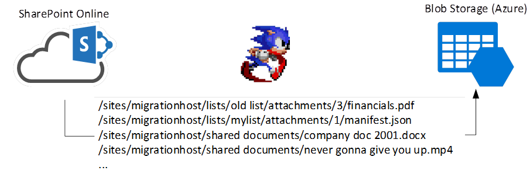

The solution also supports incremental migrations; only new or updated content is copied to blob storage. 
There are two roles in migrating data:
1.	An indexer – to find content to copy in SharePoint. Content to be indexed is based on configuration in the SQL database
2.	A migrator – to copy content found in the queue to blob-storage & update the migration log database.

In addition, the migration has a database for configuring target sites to migration, and a log of files migrated successfully (or the fatal error encountered) for each file added to the queue.

More realistic diagram:
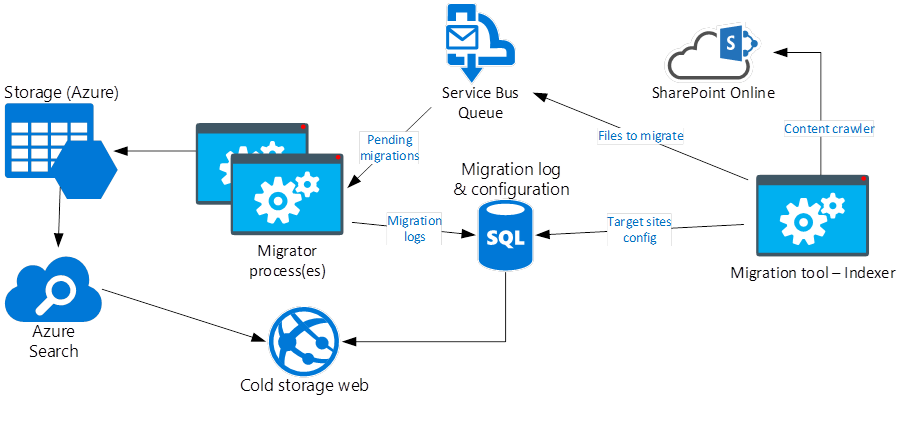

The indexer simply adds content to a queue, which is picked up by 1 or more migrator roles as items arrive to migrate to blob storage in the same tree structure it’s found in SPO. 
The migration process is high-level:

*	For files found in target SharePoint sites. Compare “last modified” date with what we have in the SQL database. If file in SharePoint is newer or hasn’t been seen before:

  *	Download file from SharePoint to temporary file location (to a location under the users “temp” directory).
  *	Upload to blob storage with same filename as was in SharePoint.
  *	Delete temporary file on local filesystem.
  *	Assuming no error, add a “migration success” registration for the file.

Migration jobs are read from the service-bus queue in order of adding them; 10 parallel items at a time.

Once in the storage account, files are accessible from the web application:
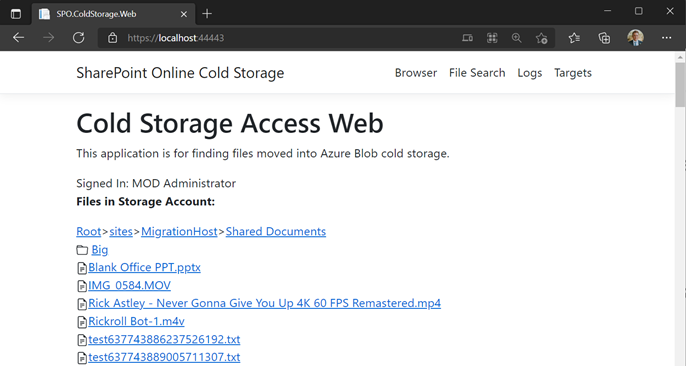

…with the ability to search the migration logs:
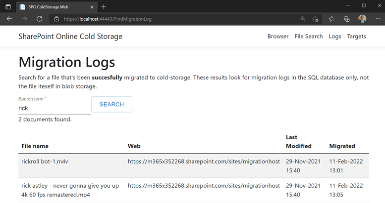

…and/or files in the Azure Search index for files migrated outside the tool too:
 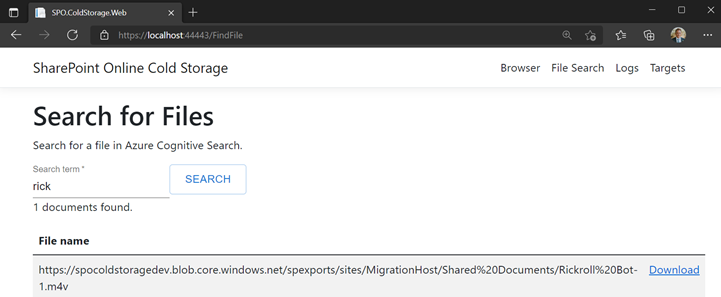

The search integration is so far basic but includes the ability to search inside the file contents thanks to Azure Cognitive Search out-of-the-box functionality. 
Finally, the configuration for indexing targets can be set in the web-application itself:
 
Next time the indexer is run, this configuration will be used to add files to the migration queue. 
## Configuration Inventory
The following configuration items are needed either in an appSettings.json file or app service configuration. 


Name | Description
--------------- | -----------
AzureAd:ClientID | ID of Azure AD application
AzureAd:Secret | Azure AD application secret value
AzureAd:TenantId | Azure AD ID for tenant with SharePoint Online in
BaseServerAddress | Base URL for SharePoint Online tenant, e.g “https://contoso.sharepoint.com”. No trailing slash.
ConnectionStrings:Storage | Storage account connection string
ConnectionStrings:ServiceBus | Service-bus queue connection string
ConnectionStrings:SQLConnectionString | SQL connection string
KeyVaultUrl | Base URL of a key-vault for downloading API certificate. No trailing slash.
AppInsightsInstrumentationKey | Optional. Application insights instrumentation key
API Scope URI | Used for React app to communicate with server-side app. Not needed for server-side configuration; just react.
Search:IndexName | Name of search index created for blob storage contents. Example: “azureblob-index”
Search:ServiceName | Name of search application. Example: “spocoldstoragedev” (https://spocoldstoragedev. search.windows.net)
Search:QueryKey | Search query key taken from the search application. Used by the React application to query the search index for results. Example: “64B017ED54A33DDE672F00AFXXXXXXXX”

During the azure component setup, take a note of each configuration item for later.

In addition to this, we also need a URL for the web-application. This is so we can configure a reply URL for the web authentication. This URL is only needed for the Azure AD application; not for solution configuration itself. 
The solution is built on .Net 6 – LTS. 
## Setup Instructions
There are three parts of the system – Azure resources, Azure AD application, and the solution itself.

Before you start: you should have clear your web URL of the website to host the administration application. In this guide we assume we’re publishing to an Azure app service with URL “https://spocoldstorage.azurewebsites.net”
## Create & Configure Solution Azure AD Application
This is the identity the application will use to connect to SharePoint, authenticate the website, and read our API access certificate from too. 
1.	Register app & follow process for “MSAL.js 2.0 with auth code flow” - https://docs.microsoft.com/en-gb/azure/active-directory/develop/scenario-spa-app-registration
a.	Note down the “client ID”, “tenant ID”.
b.	Ensure that under “authentication” we have added “single page application” with the redirect URL of our base website (https://spocoldstorage.azurewebsites.net in our example)
2.	Create a secret for registration. Note down value.
3.	Next, we’ll enable access to SharePoint Online data. This requires us to generate a certificate for access.
4.	Generate PFX for Azure AD application in PowerShell (requires PnP PowerShell - https://pnp.github.io/powershell/articles/installation.html).

```powershell
  $Password = "Corp123!"
  $secPassword = ConvertTo-SecureString -String $Password -AsPlainText -Force
  $cert = New-PnPAzureCertificate -OutPfx "AzureAutomationSPOAccess.pfx" - `
  -ValidYears 10 `
  -CertificatePassword $secPassword `
  -CommonName "AzureAutomationSPOAccess" `
  -Country "ES" `
  -State "Madrid"
```

5.	This creates a “pfx” file in the location you run the command. This file we’ll upload to an Azure Key Vault later.
   Note: if you have a PFX file already, you can use "$cert = Get-PnPAzureCertificate -Path XXX" to use this certificate. 

5.	Copy certificate public-key into Azure AD application manifest.
    *	Get credentials from the certificate object by outputting the “$cert.KeyCredentials” object from above command.

```powershell
$cert.KeyCredentials
```
Output:
```powershell
{
    "customKeyIdentifier": "giMri7Ow3eUElQUTyL2TYtiC8IE=",
    "keyId": "20b683cb-64c1-415a-81a1-ab5eab78ea2e",
    "type": "AsymmetricX509Cert",
    "usage": "Verify",
    "value":  "MIIDYDCCAkig…"
}
```

Paste PowerShell object result into app manifest:
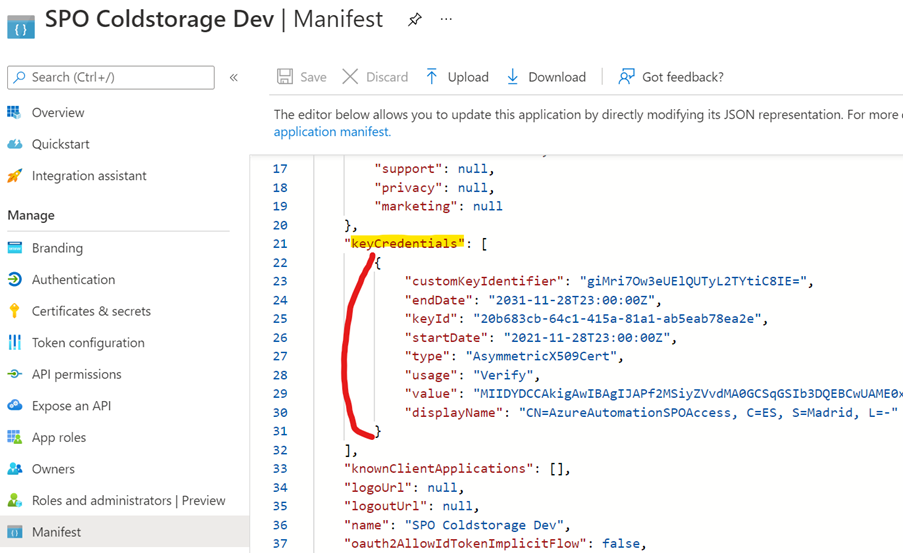

Save changes to app manifest. You’ll see a certificate in the app “certificates and secrets” section if you want to verify it worked.

6.	Grant application access to SharePoint API (Sites.Manage.All – some webs can’t be read without this permission):
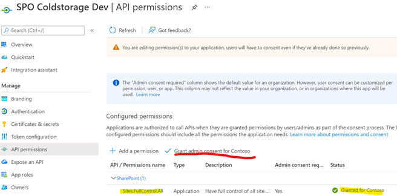
7.	Generate a client secret – used for accessing Key Vault.
8.	Expose an API so the React application can access our own protected APIs (in “expose an API” blade).

    1. Set the Application ID URI. By default this is “api://” + client ID, which is fine.
    2. Add a scope – named “access” for example. 
        1. Description: “Access API”
        2. Admins and users can access.
        3.	Set as enabled.
    3. Copy scope URL & save for later. 
       * Example: api://4d6522b1-ac89-4c02-a4ca-39181470d12c/access
9.	Save application details for configuration later:
    1.	Client ID
    2.	Tenant ID
    3.	Secret value
    4.	Certificate display name (“AzureAutomationSPOAccess”)
## Setup Azure Resources
We need certain services created in Azure for this solution to work.
1.	Create a new resource group in the same region as your SharePoint Online tenant. “SPOColdStorage” for example.
    * We’ll assume all resources go in the same region.
2.	Create a storage account, “cool” access tier; LRS (recommended). 
    1.	Note down connection string.
    2.	Enable CORs on storage account - https://docs.microsoft.com/en-us/azure/storage/blobs/quickstart-blobs-javascript-browser#setting-up
        * For “blob service” allow “GET” and “OPTIONS” from “*”, or more recommended is from your website DNS (“https://spocoldstorage.azurewebsites.net”). 
        *	Allowed headers: *
        *	Exposed headers: *
        *	Max age: 86400 (1 day)

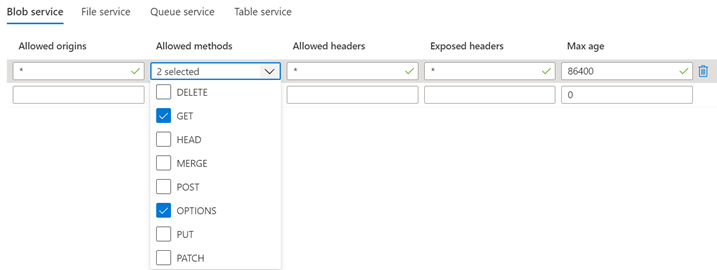

3.	Create a “Key vault”. Note down vault URL (“https://spocoldstorage.vault.azure.net/”). 
    1.	In key vault access policies, grant “get” permissions to secrets for the application ID created above. 
    2.	Import the “pfx” file created above to the certificates store of the vault. Be sure to copy the same name & password as was used to create the certificate with.
4.	Create a “Service Bus Namespace” + queue with name “filediscovery”. 
    1.	Basic tier should be fine.
    2.	The queue max size should be 5gb (or the highest permitted for the performance tier).
    3.	In the queue, add a shared access policy with permissions “read” and “send”.
    4.	Copy the primary connection string. 
5.	Create an Azure SQL database (and server too if you don’t have one) - https://docs.microsoft.com/en-us/azure/azure-sql/database/single-database-create-quickstart
1.	Recommended: use a DTU-based service tier – standard (S0) should be fine. Also “LRS” backup should be fine for this workload.
2.	The server needs SQL Server authentication enabled.
3.	Build a connection-string in a text editor like this:
```
Server=spocoldstorage.database.windows.net,1433;Initial Catalog=spocoldstorage;Persist Security Info=False;User ID=sqladmin;Password={your_password};MultipleActiveResultSets=False;Encrypt=True;TrustServerCertificate=False;Connection Timeout=30;
```

Replace the values with your own.

## Create a Search Service for Blob Storage Contents
We’ll use an Azure Cognitive Search service to keep track of contents uploaded. That way if content is moved outside the migration tool, we’ll have a single point of searching for results without any dependency on a custom solution. 

In the storage account, connect a new search service for it.
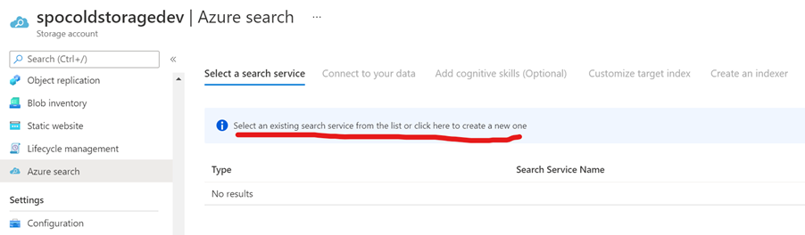

Create new & select “S” at least. 
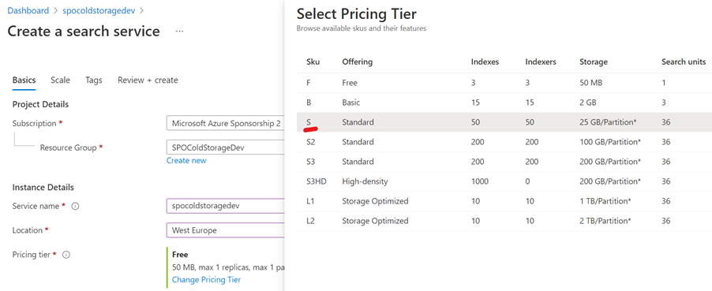

Once created, go back to the storage account & select the search service you just created to connect it.
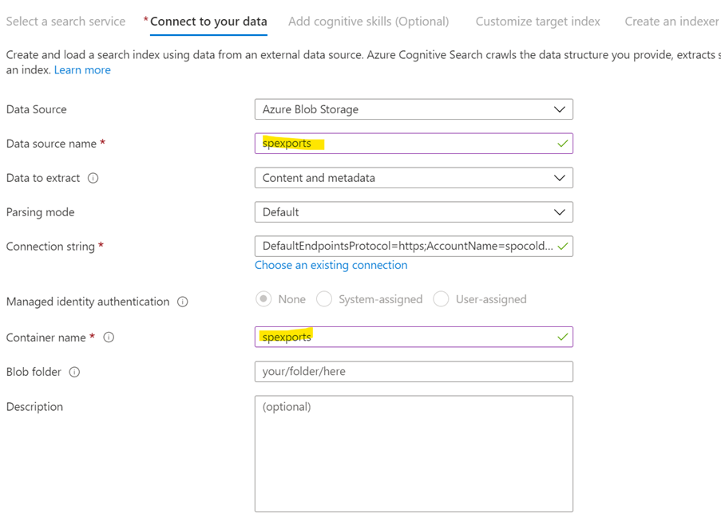

Configure the container name as the same created above. Skip the cognitive setup for now.
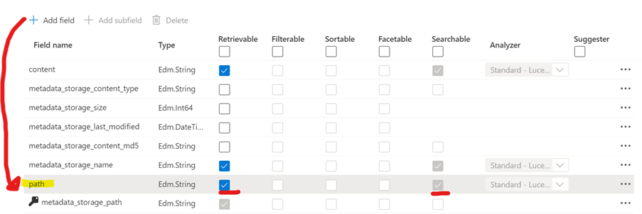

Accept default index schema but make storage name & extension searchable. Also add a new field: “path” which we’ll map later.

Next configure an indexer to populate the index:
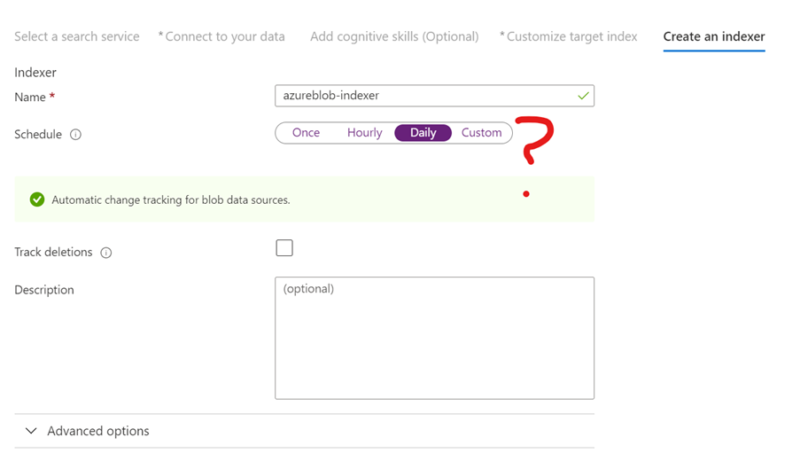

Configure an index schedule – once a day at least.
Edit created search indexer & add field mapping:

```json
  "fieldMappings": [
    {
      "sourceFieldName": "metadata_storage_path",
      "targetFieldName": "metadata_storage_path",
      "mappingFunction": {
        "name": "base64Encode",
        "parameters": null
      }
    },
    {
      "sourceFieldName": "metadata_storage_path",
      "targetFieldName": "path",
      "mappingFunction": null
    }
  ],
```

This gives us the full URL of the blob file; something we need in the web-application.

Enable CORS for the search index so it can be used from the React application:
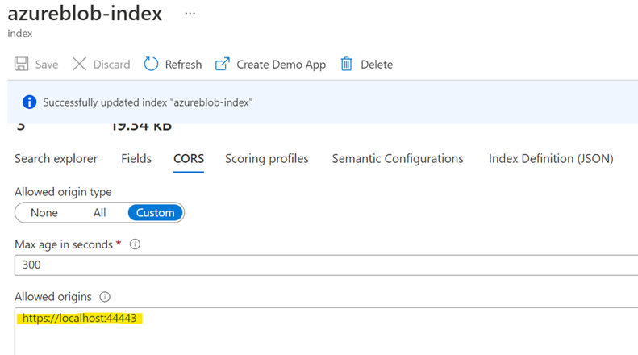

Without this, searches from the web will fail.
Once done, take note of:
* Index name
* Search application name
* Query key:
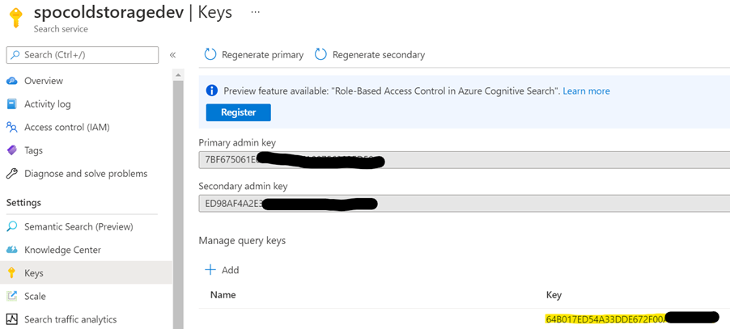

These need to be configured in the web-application/app-service configuration. See “configuration inventory” for exactly where these values need to be configured.
## Configure Service Bus Queue
The default configuration for Service Bus isn’t optimal for maximum throughput. Values we need to change:
* Message lock duration: 5mins (default 30 seconds).
    * This is so we don’t have to renew messages often for large file migrations.
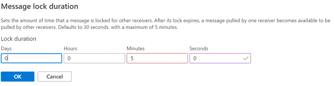
* Max delivery count: 1000 (default 10).
    * This gives a huge potential to parallel process files.
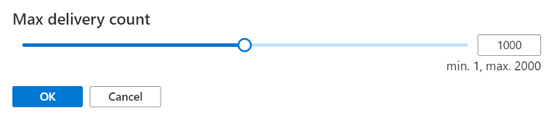

# Azure App Services Only – Configure Extra Setting
Certificate processing need specific configuration for Azure app services.
https://docs.microsoft.com/en-us/azure/app-service/configure-ssl-certificate-in-code#load-certificate-from-file

Short version: add this setting to the app service configuration:

    WEBSITE_LOAD_USER_PROFILE=1

This allows the code to read certificates from an App Service host. 

## Configure React Azure AD
In “SPOColdStorage\SPO.ColdStorage.Web\ClientApp\src” there is a file – “authConfig template.js”. Make a copy to the same folder with name “authConfig.js”.
Edit the copied “authConfig.js” and insert Azure AD configuration:

* clientId – Azure app client ID.
* authority - https://login.microsoftonline.com/+ tenant Id.
* redirectUri – the root path of your web-application.
* loginRequest scopes – the API scope URI you created above.

This file is what the react app reads to complete a successful authentication.
## Configure Application(s)
We should now have all the details we need to run the system. How you run it though is up to you – the main applications are just console applications so could run anywhere: a virtual machine, Kubernetes, or an app service as web-jobs. Configuration is taken from user secrets (dev), environmental variables, and “appsettings.json”.

To run locally, you just need to edit the “appsettings.json” and add the missing configuration using your values & the configuration table above. 

For dev environment you should use the secrets system by running these commands:
*	dotnet user-secrets set "AzureAd:ClientID" "$value" 
*	dotnet user-secrets set "AzureAd:Secret" "$value" 
*	dotnet user-secrets set "AzureAd:TenantId" "$value" 
*	dotnet user-secrets set "ConnectionStrings:ColdStorageDbContext" "Server=(localdb)\\mssqllocaldb;Database=SPOColdStorageDbContextDev;Trusted_Connection=True;MultipleActiveResultSets=true" 
*	dotnet user-secrets set "ConnectionStrings:ServiceBus" "$value" 
*	dotnet user-secrets set "ConnectionStrings:Storage" "$value" 
*	dotnet user-secrets set "KeyVaultUrl" "https://spocoldstoragedev.vault.azure.net" 
*	dotnet user-secrets set "BaseServerAddress" "https://m365x352268.sharepoint.com"  
These settings are used for creating test data for development environment but aren’t used normally:
*	dotnet user-secrets set "Dev:DefaultSharePointSite" "$value" 

## Publish Applications
At this point we should have the infrastructure we need to run the system. In this example we’re going to just use an app service we created earlier & publish everything there.
We’re going to just do it directly from Visual Studio, but it’s recommended you setup a DevOps pipeline to do this instead.

Publish the website:
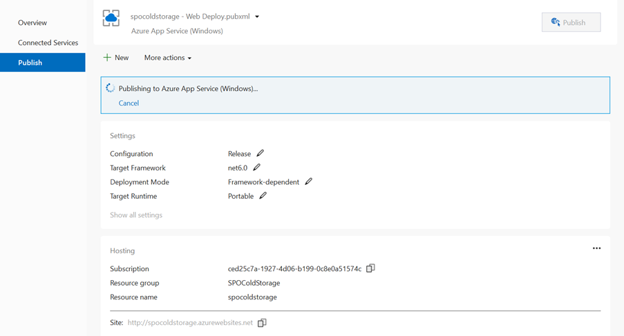
## Publish the web-jobs:
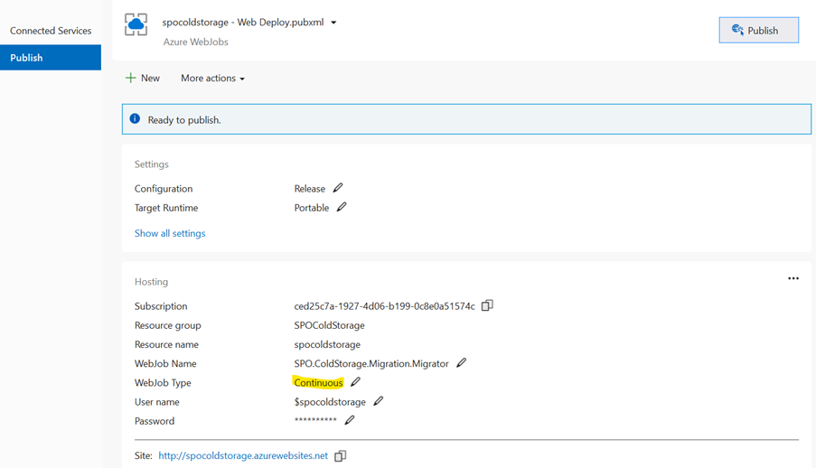
Web-jobs are a convenient container for these migration applications but will have problems scaling. See below.
# Testing Application
Once published, open the website and see if you can login. Assuming no problem, add root SharePoint site URLs to the list to be indexed:
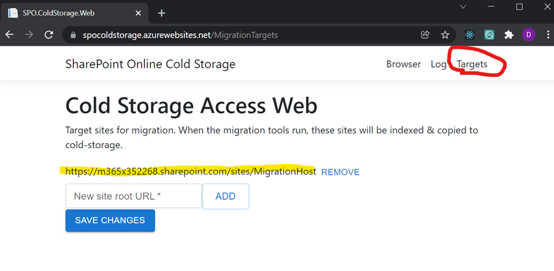

Next check the web-jobs are running ok:
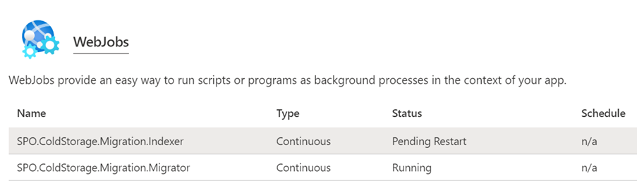

The indexer will run & exit making app services restart it as it is continuously run.
# Performance Tuning
To get the best transfer rates there are a few factors to bear in mind:
*	Compute power for migration roles especially.
    *	For urgent migrations it’s probably worth deploying the roles in a virtual-machine or VM set with high-performance disks and at least x8 cores each.
    * App services are great for a managed environment but don’t offer the best performance tier if you need raw power to shift huge datasets. 
*	Parallelism of roles. If you see a lot of messages waiting in service-bus (>1000 messages in the queue), then you should consider adding more migrator processes.
*	SharePoint Online throttling: you can see how much throttling is being applied to the current application identity by searching App Insights traces for “Got throttled by SharePoint Online”.
    *	The system will back-off with increasing delays if throttled; the indexer especially will parse the “retry after” response header to avoid being blocked.
    *	Read more about SPO throttling here - https://docs.microsoft.com/en-us/sharepoint/dev/general-development/how-to-avoid-getting-throttled-or-blocked-in-sharepoint-online 

**Also important**: for large migrations, large staging disks are needed for the migrators. Files are staged in the “%TEMP%” system variable location. If the largest files in SharePoint Online to be migrated are a maximum of 100gb and x10 migrators are executing on the same VM, this disk staging location will need 100GBx10 + a reasonable buffer space of free disk space, minimum (1.5Tb). 
# Troubleshooting
If you get the “HTTP Error 500.30 - ASP.NET Core app failed to start” error on the web-application, the chances are there’s some configuration that’s wrong. 
Enable STD logging by editing the web.config file and setting ‘stdoutLogEnabled’ to ‘true’:
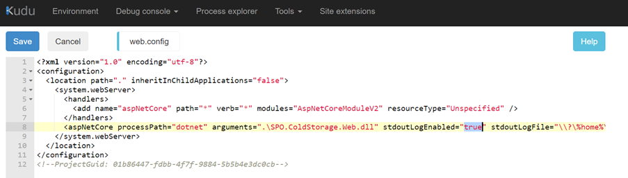
Logs are then written to “C:\home\LogFiles” which should give you a clue about the problem.

Logs & exceptions are also sent to Application Insights if it’s enabled. 
