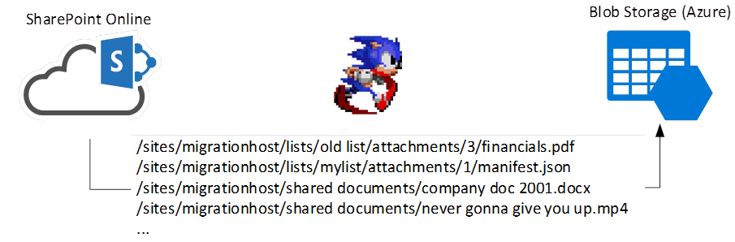

# SPO Cold Storage Export Solution

A "cold storage" backup tool for **SharePoint Online document libraries**: it
copies file data out of SPO drives to Azure Blob Storage for longer-term
retention. It supports incremental migrations — only new or updated content is
copied on subsequent runs.

> **Scope**: this solution intentionally only handles **drives and files**
> (document libraries). Custom lists, list items, and list-attachment migration
> are **out of scope** in this repository. All access is via the **Microsoft
> Graph API**; there is no CSOM or SharePoint REST code path. Authentication is
> always client-credential (client secret) — no certificates, no Key Vault for
> certificates.

Simple solution diagram:



## Roles

There are three roles in the solution:

1. **Snapshot Builder** (`Migration.SiteSnapshotBuilder`) — enumerates sites in the
   tenant via Microsoft Graph, then for each site walks every drive (document
   library) and persists discovered files into the SQL database. Uses Graph
   delta queries so subsequent runs are incremental.
2. **Indexer** (`Migration.Indexer`) — walks the discovered content for sites
   configured for migration, and pushes each file onto a Service Bus queue for
   the migrator.
3. **Migrator** (`Migration.Migrator`) — listens on the Service Bus queue and
   for each message downloads the file from SharePoint via Graph and uploads it
   to Azure Blob Storage, preserving the original path. Migration log entries
   (success/failure) are written to the SQL database.

A small ASP.NET Core web application (`Web/Web.Server` + `Web/web.client`) is
included for configuring which sites to index and for searching the migration
log and blob index.

More realistic diagram:


## High-level migration flow

For each file discovered in a target SharePoint site, the migrator compares the
SPO `LastModified` timestamp with what's in SQL. If the file is newer or has
never been seen:

* Download the file from SharePoint via Graph (`/drives/{driveId}/items/{itemId}/content`)
  to a temp location.
* Upload to Blob Storage with the same relative path as the source.
* Delete the temp file.
* Write a "migration success" record (or an error record on failure).

Up to 10 messages are processed in parallel by each migrator instance.

Once content is in Blob Storage, the included web application can list and
search through the migrated content (via an Azure AI Search index that points
at the blob container).

## Database structure

For detailed information about the SQL database schema, tables, relationships,
and common queries, see **[Database Structure Documentation](DATABASE_STRUCTURE.md)**.

## Configuration inventory

The following configuration items are read from `appsettings.json`, user
secrets (development), or environment variables.

| Name | Required by | Description |
|------|-------------|-------------|
| `AzureAd:ClientID` | All projects | Client (Application) ID of the Azure AD app registration |
| `AzureAd:Secret` | All projects | Client secret **value** of the app registration |
| `AzureAd:TenantId` | All projects | Azure AD tenant GUID |
| `BaseServerAddress` | Snapshot Builder, Indexer | SharePoint Online root URL (e.g. `https://contoso.sharepoint.com`, no trailing slash) |
| `ConnectionStrings:SQLConnectionString` | All projects | SQL connection string |
| `ConnectionStrings:Storage` | Migrator, Web | Blob Storage connection string |
| `ConnectionStrings:ServiceBus` | Indexer, Migrator | Service Bus queue connection string |
| `BlobContainerName` | Migrator, Web | Name of the blob container that holds migrated files |
| `AppInsightsInstrumentationKey` | Optional | Application Insights connection string or instrumentation key |
| `Search:IndexName` | Web (optional) | Name of the Azure AI Search index over the blob container |
| `Search:ServiceName` | Web (optional) | Name of the Azure AI Search service |
| `Search:QueryKey` | Web (optional) | Search query key used by the React app |

The solution targets **.NET 10**.

## Setup overview

There are three parts to setting the system up:

1. **Azure AD application registration** — see below.
2. **Azure resources** — Blob Storage, Service Bus, SQL Database, (optional) Azure AI Search, (optional) Application Insights.
3. **The solution itself** — fill in `appsettings.json` / user secrets and run.

### Azure AD application registration

Create an app registration in Microsoft Entra ID (Azure AD) and configure it as follows.

#### Application (app-only) permissions — Microsoft Graph

Add these **application** permissions on Microsoft Graph (admin consent required):

* `Sites.Read.All` — enumerate sites
* `Files.Read.All` — read files in all drives (snapshot + migrator download)

> No SharePoint REST or CSOM permissions are needed — Graph alone provides
> everything the solution uses.

#### Client secret

Under **Certificates & secrets**, create a **new client secret**. Copy the
**Value** (not the Secret ID). This is `AzureAd:Secret`.

> The solution does **not** use certificates or Azure Key Vault for app
> authentication. There is no `KeyVaultUrl` or `CertificateName` configuration
> any more.

#### (Optional) Expose an API for the React web app

If you want to use the included web administration application, follow the
"MSAL.js 2.0 with auth code flow" registration steps and:

1. Set the Application ID URI (default `api://<client-id>` is fine).
2. Add a scope (e.g. `access`) and enable it.
3. Add a single-page-application redirect URI for the web app's URL.

Note the Client ID, Tenant ID, secret Value, and scope URI for later.

### Azure resources

1. **Resource group** — create one in the same region as your SharePoint Online tenant.
2. **Storage account** — Cool access tier, LRS recommended. Note the
   connection string. If the React app will browse blobs, enable CORS on the
   blob service (GET, OPTIONS from your web app's origin or `*`).
3. **Service Bus namespace** + queue named `filediscovery`. Basic tier is
   sufficient. In the queue:
    * Max size: 5 GB (or the largest your tier allows).
    * **Message lock duration: 5 minutes** (default is 30 s — too short for large
      file migrations).
    * **Max delivery count: 1000** (default is 10).
    * Add a shared access policy with `Send` + `Listen` permissions and copy
      the primary connection string.
4. **Azure SQL Database** — DTU S0 is enough. The server needs SQL
   authentication enabled. Build a connection string and save it.
5. *(Optional)* **Azure AI Search** service for the web app's blob search
   integration. Connect a data source to the blob container; map
   `metadata_storage_path` to itself (with `base64Encode`) and to a `path`
   field. Enable CORS on the index so the React app can call it. Save the
   service name, index name, and a query key.
6. *(Optional)* **Application Insights** for telemetry.

### RBAC for Azure resources

The application authenticates to Azure resources using the same Azure AD
application registration (service principal) as for SharePoint Graph access,
or — when running in Azure compute — a managed identity. Assign these roles
to the identity:

| Resource | Role | Why |
|----------|------|-----|
| Storage account | **Storage Blob Data Contributor** | Migrator writes blobs; web reads them |
| Service Bus namespace | **Azure Service Bus Data Sender** | Indexer queues files |
| Service Bus namespace | **Azure Service Bus Data Receiver** | Migrator dequeues files |
| (Optional) Azure AI Search | **Search Index Data Reader** | Web queries the index |

RBAC role assignments can take up to 5 minutes to propagate. For production
deployments, prefer Managed Identity over a service principal with a secret.

### Configure the solution

`appsettings.json` (or user secrets for development) needs to look something
like this. Only set the keys that the project you're running actually needs
(see the inventory table above):

```json
{
  "BaseServerAddress": "https://yourtenant.sharepoint.com",
  "BlobContainerName": "spexports",
  "SearchIndexName": "spexports",
  "AzureAd": {
    "TenantId": "your-tenant-id",
    "ClientID": "your-client-id",
    "Secret": "your-client-secret"
  },
  "ConnectionStrings": {
    "SQLConnectionString": "Server=...;Database=SPOColdStorage;...",
    "Storage": "DefaultEndpointsProtocol=https;AccountName=...;AccountKey=...",
    "ServiceBus": "Endpoint=sb://...;SharedAccessKeyName=...;SharedAccessKey=..."
  }
}
```

For local development, prefer user secrets:

```powershell
dotnet user-secrets set "AzureAd:ClientID" "<value>"
dotnet user-secrets set "AzureAd:Secret" "<value>"
dotnet user-secrets set "AzureAd:TenantId" "<value>"
dotnet user-secrets set "BaseServerAddress" "https://yourtenant.sharepoint.com"
dotnet user-secrets set "ConnectionStrings:SQLConnectionString" "Server=(localdb)\\mssqllocaldb;Database=SPOColdStorageDev;Trusted_Connection=True;MultipleActiveResultSets=true"
dotnet user-secrets set "ConnectionStrings:Storage" "<value>"
dotnet user-secrets set "ConnectionStrings:ServiceBus" "<value>"
```

### Configure the React web app

In `src/Web/web.client/src` copy `authConfig template.js` to `authConfig.js`
and fill in:

* `clientId` — Azure AD app Client ID
* `authority` — `https://login.microsoftonline.com/<tenant-id>`
* `redirectUri` — the root URL of the deployed web app
* `loginRequest.scopes` — the API scope URI you exposed

## Run

```powershell
# Build snapshots of every site
dotnet run --project src/Migration.SiteSnapshotBuilder

# Queue files for sites configured for migration
dotnet run --project src/Migration.Indexer

# Process the queue — copy files to Blob Storage
dotnet run --project src/Migration.Migrator

# Run the web administration application
dotnet run --project src/Web/Web.Server
```

The three console apps can be deployed wherever you like (App Service
WebJobs, container apps, plain VMs, Kubernetes…). The Migrator is
horizontally scalable — run multiple instances to increase throughput.

## Performance tuning

* **Compute** — the migrators are I/O-bound, but for fast multi-terabyte
  migrations you'll want machines with high-throughput network and disk.
* **Parallelism** — if the Service Bus queue depth grows past ~1000, scale
  out the number of migrator processes.
* **SharePoint Online throttling** — the Graph SDK + the migrator's back-off
  logic will respect `Retry-After` headers. Watch App Insights traces for
  throttling events. Read more: <https://learn.microsoft.com/en-us/sharepoint/dev/general-development/how-to-avoid-getting-throttled-or-blocked-in-sharepoint-online>.
* **Staging disk** — files are downloaded to the system `%TEMP%` location
  before upload. Make sure the host machine has enough free disk for the
  largest file × the number of parallel migrators, plus headroom.

## Troubleshooting

* **`AADSTS7000215` (Invalid client secret)** — copy the secret **Value**,
  not the ID, and check it hasn't expired.
* **`Sites.Read.All` or `Files.Read.All` permission denied** — ensure admin
  consent has been granted for the application permissions on Microsoft
  Graph.
* **Web app shows HTTP 500.30** — usually a configuration problem. Enable
  stdout logs in `web.config` and inspect `C:\home\LogFiles` (on App Service)
  or your container logs.
* **Telemetry** — when `AppInsightsInstrumentationKey` is set, exceptions
  and traces are exported to Application Insights via OpenTelemetry.
