# SPOAzBlob
SPO Front-end for files in Azure Blob Storage.

Keep files in Azure blob storage; edit them in SharePoint Online. All the scalability of Azure blob with the editing facilities of SharePoint Online – needed especially if you can’t workaround the [SharePoint Online service limits](https://docs.microsoft.com/en-us/office365/servicedescriptions/sharepoint-online-service-description/sharepoint-online-limits).

Usually, MS advice is to keep everything in SPO if you can but sometimes that’s just not possible without major headaches. Requirements like lots of data in the same directory; lots of unique permissions, for example will cause said headaches and this solution is a possible alternative way of doing things. 

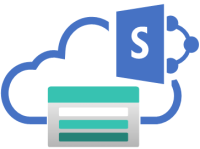

Azure blob storage doesn't do everything SharePoint does but it does scale way better for massive datasets. Why not combine the best of both worlds?
## Basic Architecture
In this solution we have an:

* ASP.Net + react app to browse files in the storage account and control editing flows.
* Azure function-app to get content update notifications from Graph when editing.
* Storage account to hold files & keep track of file locks.

Here’s how this proof-of-concept works, high-level:

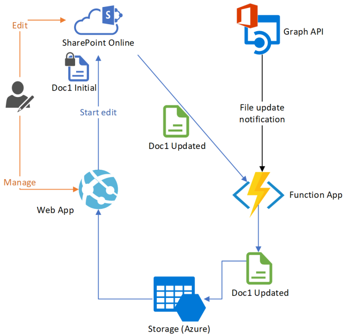

Files start in Azure blob storage. When someone wants to edit a file, it’s copied into SPO where the user can edit it, and the file is “locked” in our system. 

While the file is locked, only updates from the locking user will be accepted and updates are received thanks to Graph notifying us of content changes.

When the user has finished, the file is unlocked which makes one last copy back to Azure blob, releases the lock, and deletes the file in SPO. 
## How it Works
First, you need to login to the react app with Azure AD:

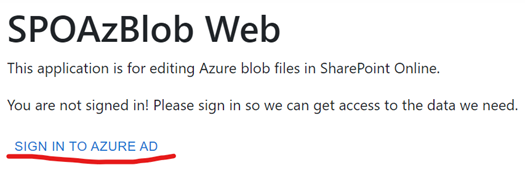

This allows the react app to get storage keys from the solution asp.net APIs using a bearer token, and this same login we use for navigating to SharePoint Online.

From the react app you can then start editing files by first locking the file:

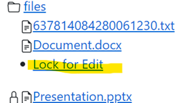

Once locked you can edit it:

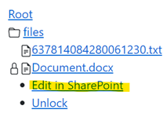

This’ll copy the file to a SharePoint staging site and give you a SharePoint URL where you can edit the file within SharePoint & Office Online:

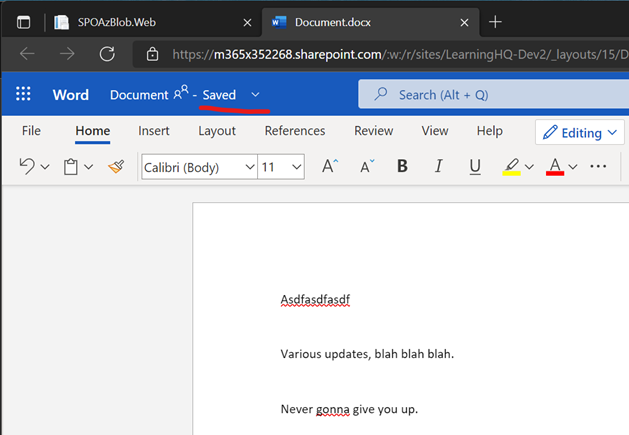

As updates are made in Office Online & SharePoint, Graph will notify the function application of these updates:

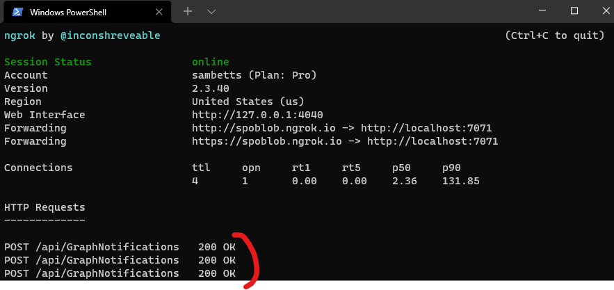

Note: these update subscriptions are managed in the react app too, and in a timer function in the functions app. 
With each update notification, the new file contents are copied back into the blob storage account. As part of the update, the active lock checks the file is being edited & by who, so we don’t overwrite the wrong files accidentally.

Once done the file can be unlocked (manually or with an automatic lock expiry). 
## Setup Requirements
To get this working you’ll need:
* Visual Studio 2022.
* Node LTS (v16.14)
* Dev: 
    * ngrok – paid account recommended so you can have static domain names.
    * Windows Azure Storage Emulator/Azurite
* A SharePoint Online site you have full control over.
* An Azure subscription.

For production, the function-app needs a public HTTPS endpoint.

## Configuration Inventory
Common configuration to all projects:

Name | Example Value | Description
--- | ---- | ----
BlobContainerName | files | Container in the blob storage account with the files
SharePointSiteId | contoso.sharepoint.com,xxxxxx-...,xxxxx-… | Graph ID for target SharePoint site
ConnectionStrings: Storage | DefaultEndpointsProtocol=https;…. | Storage account primary connection string
ConnectionStrings: ServiceBus | Endpoint=sb://... ;EntityPath=graphupdates | Service bus connection string, for a specific queue (‘graphupdates’).
AppInsightsInstrumentationKey | bf8e8ec5-aaaaa-bbbbb-a6c3-6ac864c309b9 | Used for telemetry & tracing
AzureAd:TenantId | 0cceb74a-aaaaa-4794-bd1e-3bb476333026 | Azure AD app registration 
AzureAd:Domain | contoso.onmicrosoft.com | Azure AD app registration
AzureAd:Secret | Hh17Q~6NoLlsjS24H…. | Azure AD app registration
AzureAd:ClientID | 0cceb74a-bbbb-4794-bd1e-3bb476333026 | Azure AD app registration
WebhookUrlOverride | https://spoblob.ngrok.io/api/GraphNotifications | Function app public-url. For dev, needs to be an ngrok HTTPS URL + "/api/GraphNotifications".
```[API_SCOPE]``` | api://0cceb74a-3126-4794-bd1e-3bb476333026/access | API scope Uri for calling own ASP.Net API.
## Unit tests configuration:
Name | Example Value | Description
--- | --- | ---
AzureAdAppDisplayName | [Same as your Azure AD display name] | Used in unit-tests to ensure locks have the right edit name. Files are uploaded as the app identity so without this info tests won’t work.
TestEmailAddress | adelev@m365x352268.onmicrosoft.com | Used for getting user from Graph tests. There's a unit-test that does a user lookup, and this value is what the test uses to find a Graph user by.

# Setup Steps
Here’s how to get this solution working. For now, we assume you’re running this solution from Visual Studio.
Create Azure AD Application
Create an Azure AD registration for the web application:
1.	Register app & follow process for “MSAL.js 2.0 with auth code flow” - https://docs.microsoft.com/en-gb/azure/active-directory/develop/scenario-spa-app-registration
    * Note down the “client ID”, “tenant ID”.
    * Ensure that under “authentication” we have added “single page application” with the redirect URL of our base website (https://contosofiles.azurewebsites.net for example, of if we’re debugging locally, it’ll be https://localhost:44433/)
2. Create a secret for registration. Note down value.
3. Create an API scope so we can call from the React app to the ASP.Net Web API with a JWT bearer token.
   * On "Expose an API" set your Application ID URI. The default of "api://" + app ID is fine.
   * Create a new scope. Name: "access", for admins and users.
   * Copy the scope Uri: it shoulc be something like "api://" + app ID + "/acesss". This value goes into the "authConfig.js" file (see below).
4. Grant Graph application permissions: User.Read.All, Sites.Selected to the Azure AD application. Make sure you get the admin approval.

These settings you’ll need for the configuration of the solution later.

## Create Required Azure Resources
We need created:
1.	An Azure storage account. Enable file versions & soft delete if you want.
    * Note down primary connection-string.
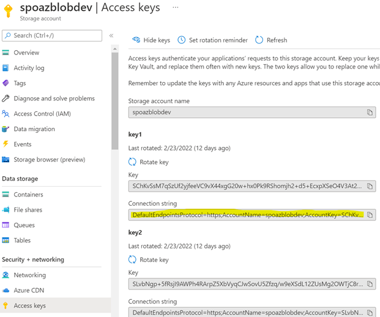
2.	Service Bus Namespace + a new queue with name “graphupdates”.
    * Get namespace connection-string:
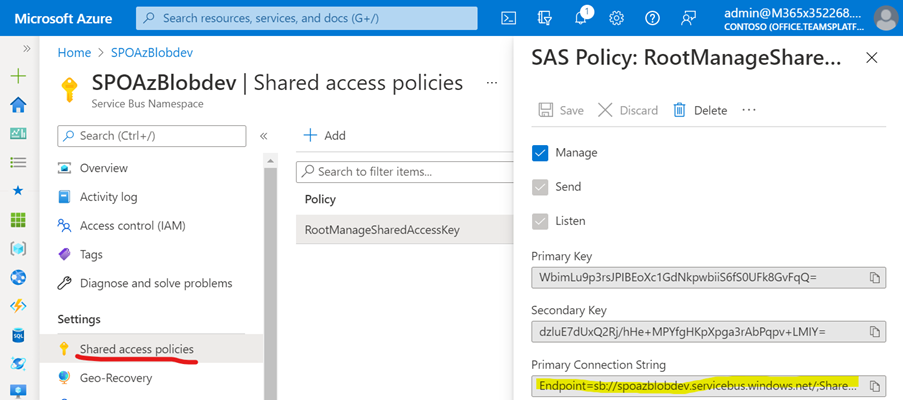

This will be the “```<<SB NAMESPACE CONNECTION STRING>>```” value.
    * In the queue, create a new shared access policy (any name you want) with “send” and “listen” rights. Copy queue connection-string:
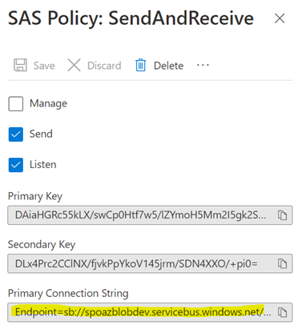

This will be the “```<<SB QUEUE CONNECTION STRING>>```” value.

Note: there are two connection-strings we need for service-bus: the namespace connection-string and the queue connection-string.

Example *queue* connection string:

    Endpoint=sb://spoazblobdev.servicebus.windows.net/;SharedAccessKeyName=SendAndReceive;SharedAccessKey=D…U=;EntityPath=graphupdates

Namespace version (minus “EntityPath”):

    Endpoint=sb://spoazblobdev.servicebus.windows.net/;SharedAccessKeyName=SendAndReceive;SharedAccessKey=D…U=

3.	Create Application Insights for telemetry and tracing. Note down instrumentation key:

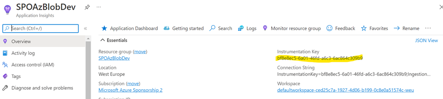

For production deployments you’ll want to host the web-application in an app service, and the functions app in a proper function app.
## Grant Application Registration Access to SharePoint Site
The app needs to access SharePoint, which we do via the “Sites.Selected” permission to selectively allow access to specific sites. This process is documented here. 
In order to grant scoped SharePoint permissions however, we temporarily need “Sites.FullControl.All” in order to do so. This can be revoked once done – see below for how.
Go to the Graph Explorer and request permission “Sites.FullControl.All” for Graph Explorer:

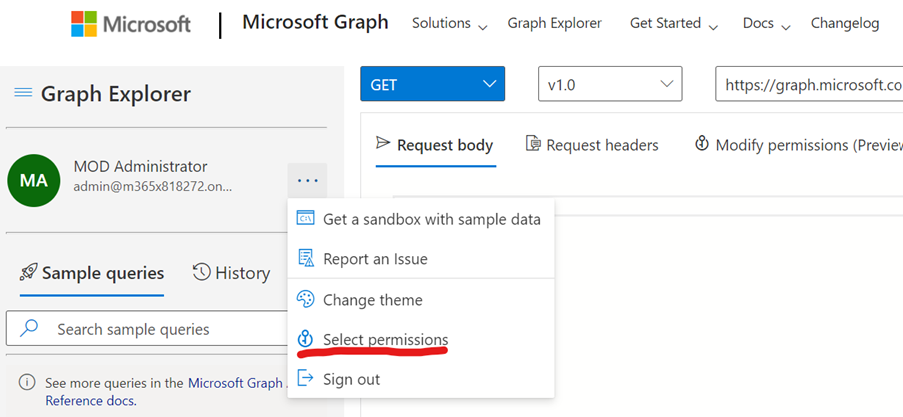

Search for the permission “Sites.FullControl.All”:

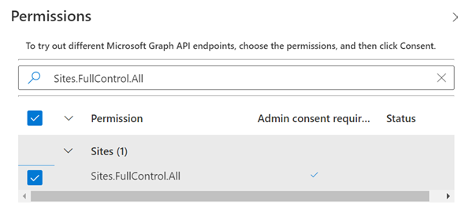

Click “consent”. You’ll be asked to authorise the application permission, for Graph Explorer:

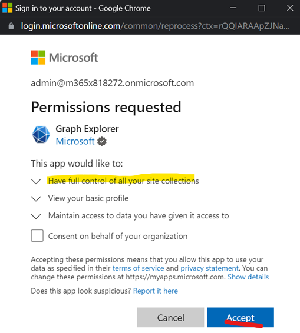

Verify the permission is added:

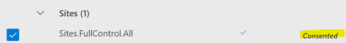

Now we can create scoped permissions for the application via less overreaching “Sites.Selected” permission. Once done we can remove “Sites.FullControl.All” permission from Graph Explorer if needed.
## Grant CORs Access on the Storage Account
We use client-side scripting to query blob container contents, but this needs to be enabled in the storage account. Enable CORs on storage account - https://docs.microsoft.com/en-us/azure/storage/blobs/quickstart-blobs-javascript-browser#setting-up

* For “blob service” allow “GET” and “OPTIONS” from origin “*” (more recommended is from your website DNS “https://spocoldstorage.azurewebsites.net”).
  * Allowed headers: *
  * Exposed headers: *
  * Max age: 86400 (1 day)

### Create the Sites.Selected permission:
Send a request like this to Graph Explorer, changing the highlighted values.

```json
POST: https://graph.microsoft.com/v1.0/sites/m365x352268.sharepoint.com,ecde8139-bf1b-4965-b3dc-52be84c9bed9,25db7f8a-05fa-4de0-a0ab-044c815dfefc/permissions
{
    "roles": [
        "write"
    ],
    "grantedToIdentities": [
        {
            "application": {
                "id": "59499c20-fa38-4b85-8899-401153655f72",
                "displayName": " Contoso Files"
            }
        }
    ]
}
```

Change this ID for your site ID, and this ID (under the “application” section in the JSon body) for your application ID.
Change the ID in the body for you application registration ID.

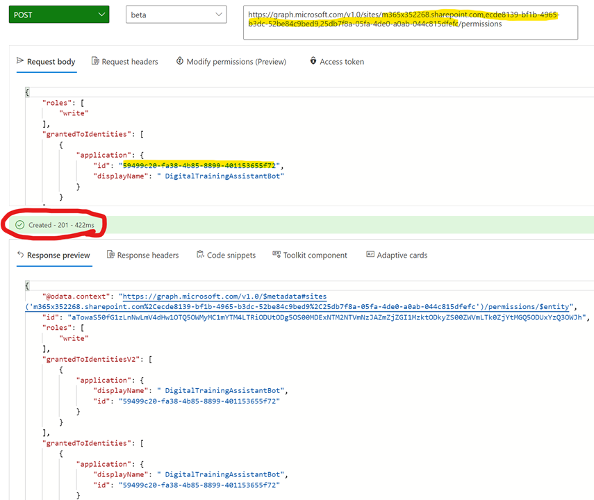

More info on creating site-specific permissions:
https://developer.microsoft.com/en-us/graph/blogs/controlling-app-access-on-specific-sharepoint-site-collections/
### Optional: Revoke “Sites.FullControl.All” for Graph Explorer
Once permissions to the right sites are created, you can revoke this permission again if you need.

1.	Find the Graph Explorer enterprise application:

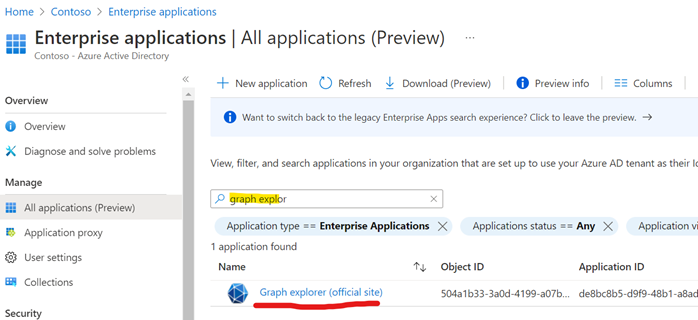

Go to permissions & click “review permissions”:

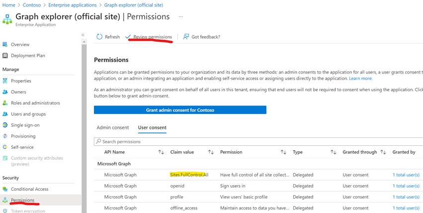

Select “this application has more permissions than I want”.

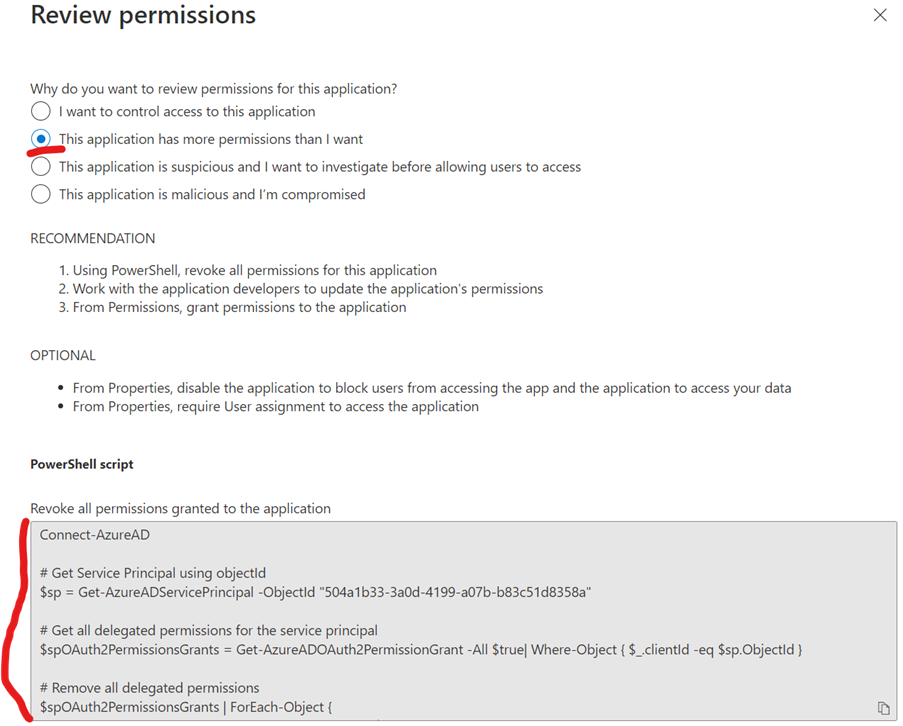

It gives you a PowerShell script to remove permissions for this application. Review and execute as appropriate (careful not to remove any permissions you still want!).
## Dev: Create Local Environment Configuration Files
Configuration files aren’t tracked in git, so you need to create them manually.
Files you need to create:
* SPOAzBlob.Web/appsettings.Development.json
* SPOAzBlob.Web/ClientApp/src/authConfig.js
* SPOAzBlob.Functions/local.settings.json
* SPOAzBlob.Tests/appsettings.json

Each of these have a template version in the same directory (e.g “appsettings.Development - template.json”). Create the above files from their template equivalents. 
Note that local.settings.json (the function app) needs both the queue & namespace connection-strings for service-bus. 

## Optional: Add Search to Azure Blob Contents
Assuming you need to later search for content again, you can add a search service that handles this requirement nicely - https://docs.microsoft.com/en-us/azure/search/search-blob-storage-integration

