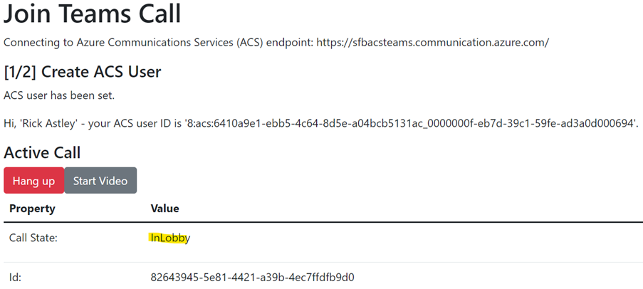

# acs-teams
Make video-calls between Teams and an external application, via ACS. You can build apps that have Teams-like functionality with Azure Communication Services (ACS) and even join regular Teams calls from an app that implements ACS. 

Here’s a react application that does just that.
## Setup: Create ACS and Set Configuration
First you need to create the service in Azure – search for “communication services”. Once created, grab the endpoint & primary key values.

These values need copying to a “.env” file in the root of the react application directory like so:

    REACT_APP_COMMUNICATION_SERVICES_ENDPOINT=https://sfbacsteams.communication.azure.com/
    REACT_APP_COMMUNICATION_SERVICES_ACCESSKEY=6lWQniCfuA1/… 

Then, just run “npm start”. No special configuration needed.
## Run Application
The first step is creating an ACS identity:

This gives you an ACS ID + access token for making calls, etc. This ID can be saved & new tokens regenerated later if you want.

Next, to join a meeting in Teams. You just need an invite link:

Joining will give you a call:

The state gets updated automatically. For this meeting we have the lobby enabled, so the meeting organiser has to admit everyone:

Once in, the user can send/receive video in the call like any other Teams guest:

Source code in this repo!
