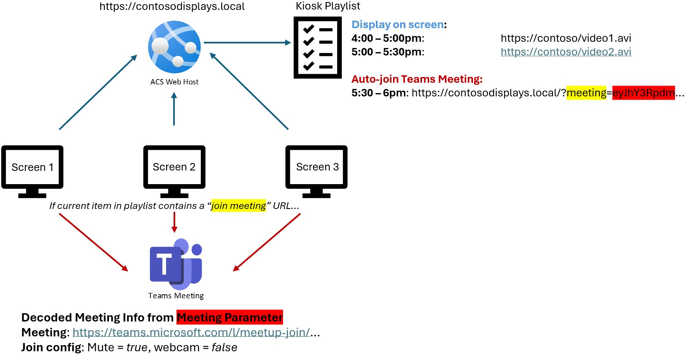
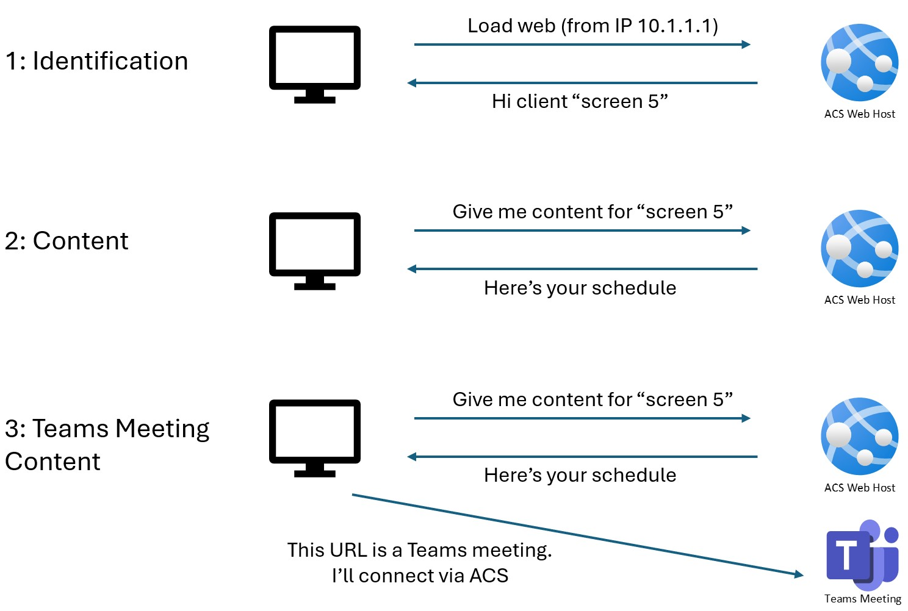

# Teams Meetings for Kiosks with ACS
Need to auto-join a Teams meeting from "kiosks" or screens that have no user interaction? This PoC shows you how.

This is a common screnario where a meeting is broadcast out using screens that otherwise display video/web content; use the same screens to also auto-join a Teams meeting, fully controlled from a central location.



With this we can add devices that have no user control to meetings too. For this we use [Azure Communication Services](https://azure.microsoft.com/en-us/products/communication-services/)

## How it Works
Each display should be indentified uniquely if each screen is to play different content. For each screen, it simply requests a playlist of URLs to diplay fullscreen.

If a URL is specifically a "auto-join" URL (it has a valid 'meeting' parameter), then it'll decode the meeting request and automatically join that meeting at the right time. 

## Solution Configuration
The VS solution needs this configuration to run:

```json
{
  "ConnectionStrings:SQLConnectionString": "Server=(localdb)\\mssqllocaldb;Database=KioskTeamsDev;Trusted_Connection=True;MultipleActiveResultSets=true",
  "AcsEndpointVal": "https://[ACSINSTANCE].communication.azure.com/",
  "AcsAccessKeyVal": "[ACCESS KEY]",
  "DefaultLocationName": "local"
}

```
Get your ACS details from your instance; endpoint and key. 

