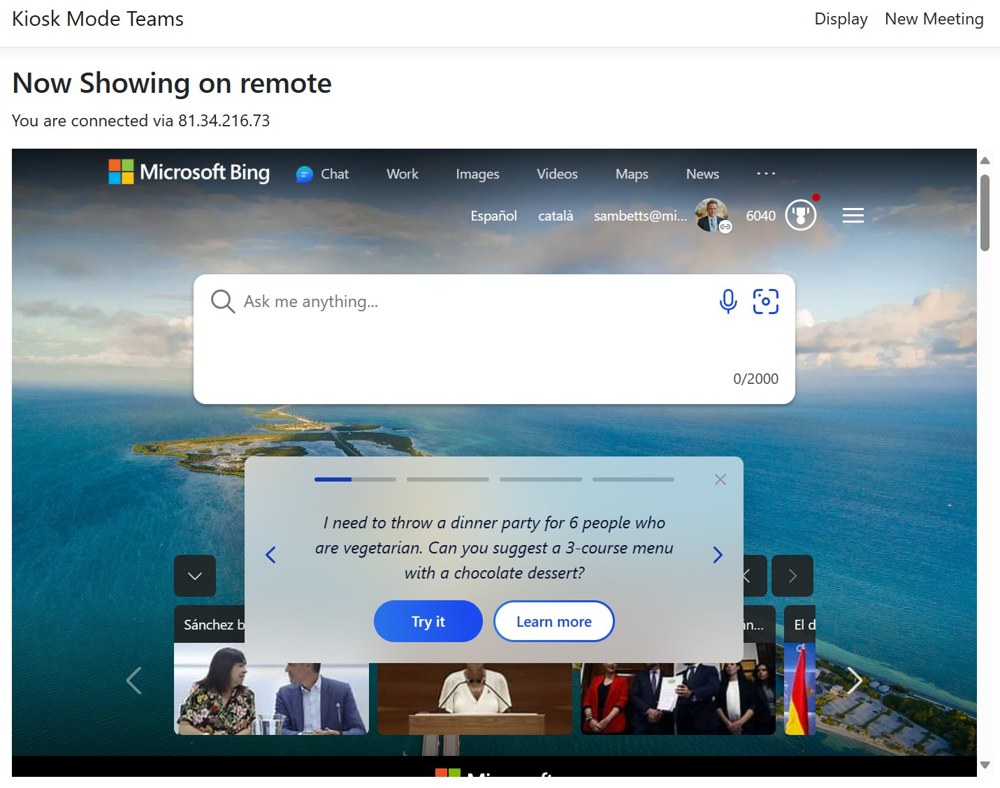

# Joining Teams Meetings with No User Interaction
Need to auto-join a Teams meeting from "kiosks" or screens that have no user interaction? This PoC shows you how that can work. No need for users to press "Join Now" - we can onboard users into pre-planned meetings without any interactions needed.

This is a common scenario where a meeting is broadcast out using screens that otherwise display video/web content only; we can use the same screens to also auto-join a Teams meeting, fully controlled from a central location.


With this we can add devices that have no user control to meetings too. For this we use [Azure Communication Services](https://azure.microsoft.com/en-us/products/communication-services/)

## How it Works
The fundamental idea is each kiosk screen has a playlist of URLs to show at certain times, and we're going to enhance that by adding a special "auto join Teams meeting" URL into that same playlist.


Here's a kiosk display, just showing normal web content. 

In this PoC, we assume multiple displays that may or may-not show different content per screen. Each display should be identified uniquely if each screen is to play different content. For each screen, it simply requests a playlist of URLs to display full screen and then show the relevant content at the right time.


If a URL is specifically an "auto-join" URL (it has a valid 'meeting' parameter), then it'll decode the meeting request and automatically join that meeting at the right time instead of simply rendering the URL. 


The "join meeting" URL is a base64-encoded JSon object with the meeting details, which you can also generate in the website:


When the JavaScript app finds this parameter in the playlist item given by the server, it'll join the meeting instead of just displaying the URL (as above).

## Solution Configuration
The VS solution needs this configuration to run:

```json
{
  "ConnectionStrings:SQLConnectionString": "Server=(localdb)\\mssqllocaldb;Database=KioskTeamsDev;Trusted_Connection=True;MultipleActiveResultSets=true",
  "AcsEndpointVal": "https://[ACSINSTANCE].communication.azure.com/",
  "AcsAccessKeyVal": "[ACCESS KEY]",
  "DefaultLocationName": "local"
}

```
Get your ACS details from your instance; endpoint and key. 
